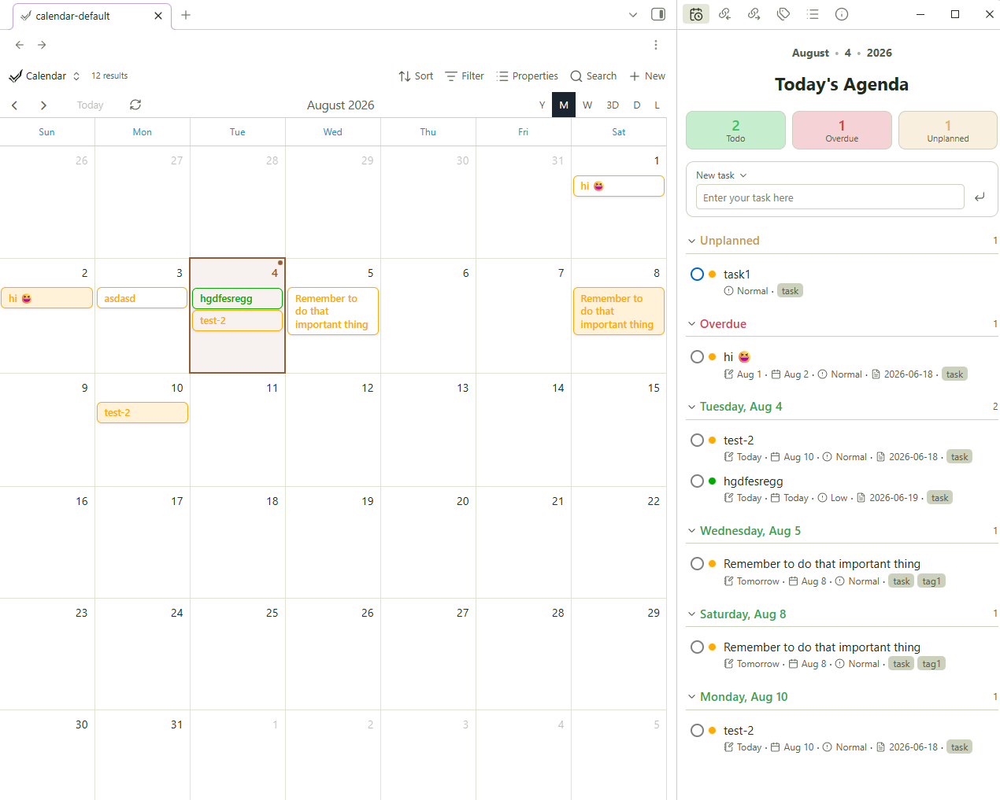
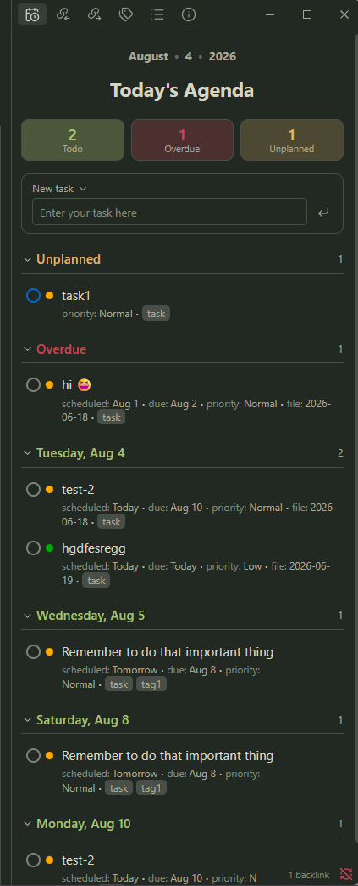

# TaskNotes Agenda Wrapper

A simple display of all your task notes in a today's agenda window for. It gives you stats, date-grouped, quick task entry, and list for the sidebar or embedded.

| | |
|:--:|:--:|
|  |  |

> Requires the [TaskNotes](https://github.com/callumalpass/tasknotes). plugin. This reads your TaskNotes tasks; it does not manage tasks on its own. 

## Features

- **Today's Agenda pane** - open it in the sidebar (or anywhere) from a ribbon icon or command.
- **Stat tiles** - Todo / Overdue / Unplanned counts. Click a tile to filter the list to that category; click again to clear
- **Emoji view** - change subtext to emojis
- **Date-grouped list** — an Unplanned section, then Overdue, then each upcoming day. Every section is collapsible
- **Quick task entry** - type a title, press Enter (or the button), and a formatted TaskNotes task note is created. Hit the dropdown next to 'New task' to topen TaskNotes creation modal
- **Native TaskNotes styling** - status and priority dots use your TaskNotes status/priority colors; the widget inherits your theme via Obsidian CSS variables
- **Interactive** - click a task title to open it; click its status ring to change status
- **Embeddable** - with code block

## Usage

### As a sidebar pane

- Click the **calendar-clock** ribbon icon, or
- Run the command **"TaskNotes Agenda Wrapper: Open Today's Agenda"**.

The pane opens in the right sidebar. Drag its tab anywhere you like.

### Embedded in a note

Add a code block:

    ```tasknotes-agenda
    ```

Optional settings inside the block:

    ```tasknotes-agenda
    title: This Week
    days: 7
    ```

- `title` — the header shown under the date line (default: `Today's Agenda`).
- `days` — how many days ahead to include (default: `14`).

## How it reads your tasks

It reads TaskNotes' own settings at runtime and falls back to TaskNotes defaults if they can't be read. A task is any note carrying your tag. Dates, status, and priority, projects, and tags come from your configured frontmatter fields. Creating and completing tasks writes standard TaskNotes frontmatter, which TaskNotes then re-indexes.

## Installation

### From the community plugins browser (once approved)

Settings → Community plugins → Browse → search **TaskNotes Agenda Wrapper** → Install → Enable.

### Manually

1. Download `main.js`, `manifest.json`, and `styles.css` from the latest [release](https://github.com/toya-co/tasknotes-agenda-wrapper/releases).
2. Copy them into `<your-vault>/.obsidian/plugins/tasknotes-agenda-wrapper/`.
3. Reload Obsidian → Settings → Community plugins → enable **TaskNotes Agenda Wrapper**.

### Via BRAT

Add `toya-co/tasknotes-agenda-wrapper` as a beta plugin in [BRAT](https://github.com/TfTHacker/obsidian42-brat).

## License

[MIT](LICENSE) © Toyo Co.
